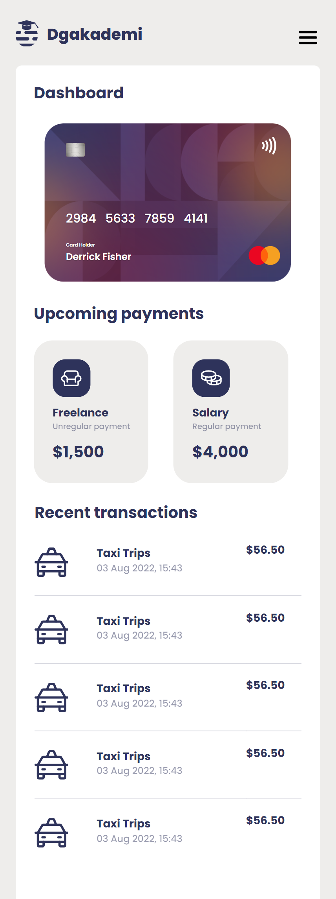
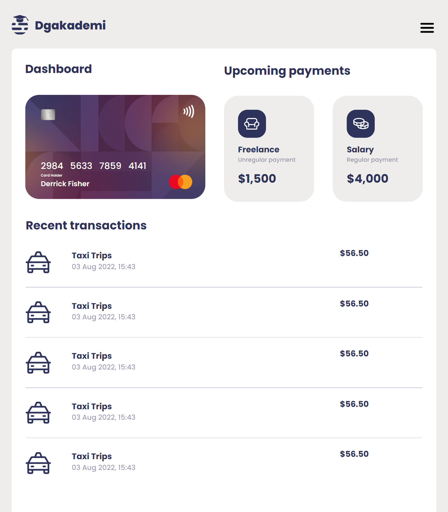
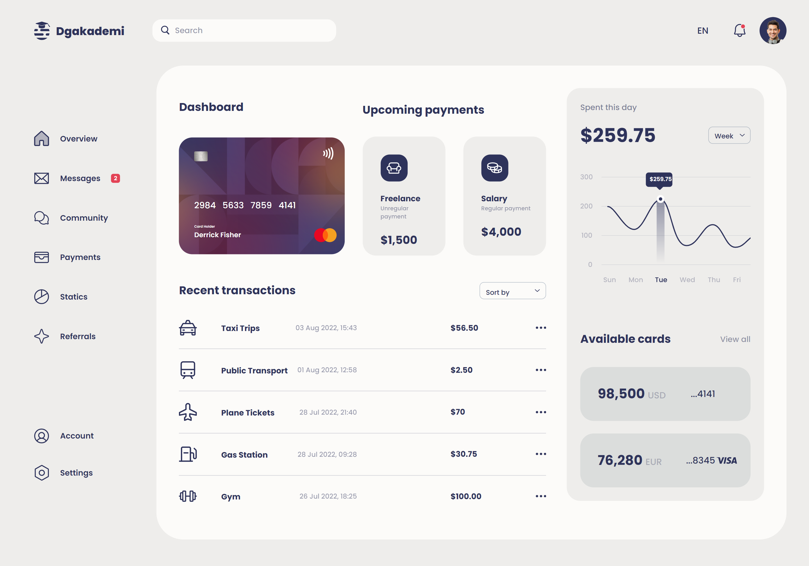

# DgAkademi | Frontend Custom Design 🔷

- Bu proje ödeme sistemleri platformunun gösterge panelini içerir. Önceden tasarlanmış [figma tasarımı](https://www.figma.com/community/file/1142503589821545823)nın html ve scss ile kodlanmış halidir.
- Mobil öncelikli olarak kodlanmıştır. Mobil ve daha geniş ekranlar için çözünürlükler ayarlanmıştır.
- Tasarıma uyularak pixel perfect tasarım yapılmaya çalışılmıştır. Aynı zamanda tasarımın görünümü de göz önünde bulundurularak kodlanmıştır.

## Kullanılan Diller veya Teknolojiler

- HTML (semantic kodlama standardı)
- SCSS (flex ve grid yapısı)

<table>
<tbody>
<tr>
<th>Mobil Görünüm</th>
<th>Tablet Görünümü</th>
<th>Laptop Görünümü</th>
</tr>
<tr>
<td></td>
<td></td>
<td></td>
</tr>
</tbody>
</table>

<b>İnceledeğiniz için teşekkür ederim.</b>
