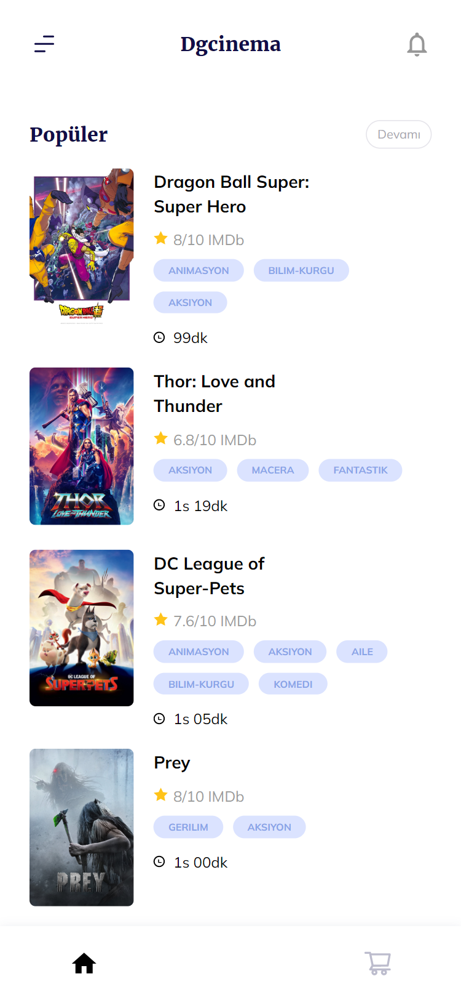
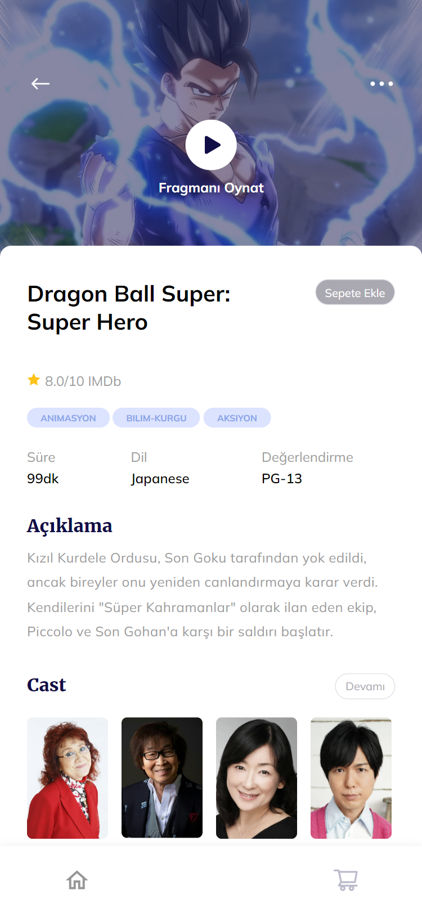
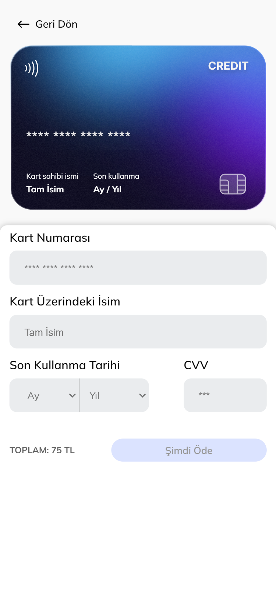
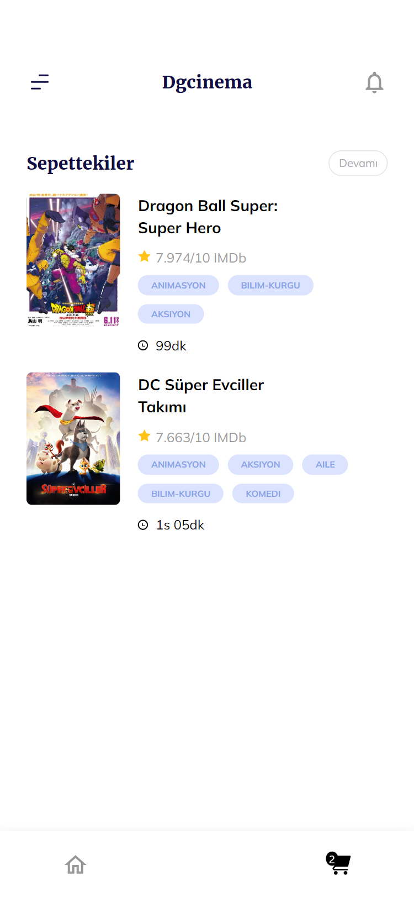
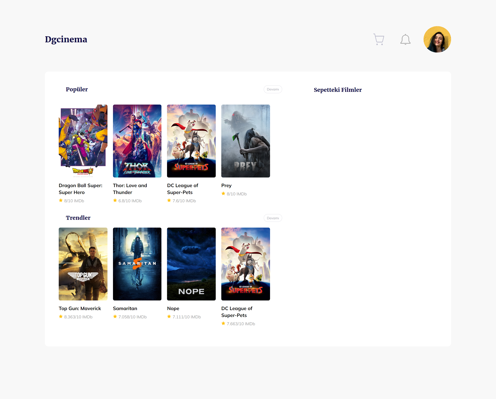
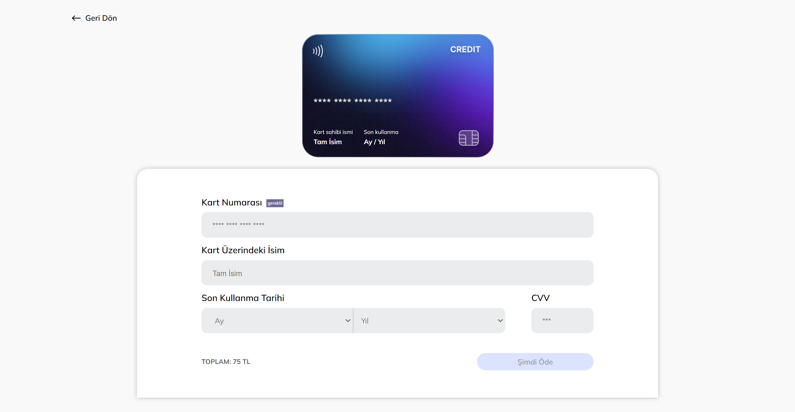
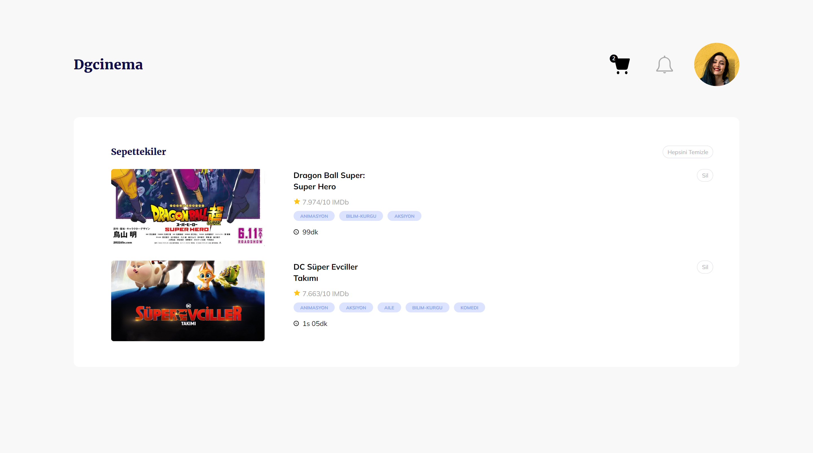
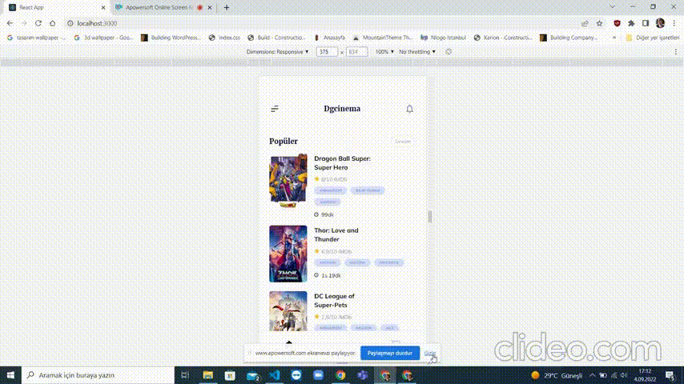

# DgAkademi Movie App 🎞 React.JS

- Bu uygulama simple page application'dır (SPA).
- Bu proje bir film uygulamasıdır ve önceden tasarlanmış [figma tasarımı](https://www.figma.com/file/Bq3LDs3EdvTQ2qGANrlSuf/Dgakademi-Movie-Mobile-App-UI-Design-(Community)?node-id=3%3A2)nın React.JS ile kodlanmış halidir.
- Mobil öncelikli olarak kodlanmıştır. Mobil ve daha geniş ekranlar için çözünürlükler ayarlanmıştır.
- Bu uygulama verileri [the-movie-db](https://www.themoviedb.org/documentation/api) adresinden almaktadır.
- Uygulamada filmler sepete eklenebilir, sepetten çıkarılabilir.
- Filmlerin kredi kartı ile satın alma işlemi animasyon ile simüle edilmiştir.
- Uygulama üç sayfadan oluşmaktadır: [Anasayfa](https://github.com/beyzanur-seyhan/DGAkademi/blob/main/Final-Project/movie-app/src/pages/Home.js), [sepettekiler](https://github.com/beyzanur-seyhan/DGAkademi/blob/main/Final-Project/movie-app/src/pages/Card.js) ve [detay](https://github.com/beyzanur-seyhan/DGAkademi/blob/main/Final-Project/movie-app/src/pages/DetailMovie.js) sayfası.

## Kullanılan Diller veya Teknolojiler

- HTML (semantic kodlama standardı)
- SCSS (flex ve grid yapısı)
- REACT.JS (Localstorage, Context API, axios, react-router, UseEffect ve UseState hooks)

## Görünüm

### Mobil
<table>
<tbody>
<tr>
<th>Anasayfa</th>
<th>Detay Sayfası</th>
<th>Satın Al</th>
<th>Sepettekiler</th>
</tr>
<tr>
<td></td>
<td></td>
<td></td>
<td></td>
</tr>
</tbody>
</table>

### Masaüstü
<table>
<tbody>
<tr>
<th>Anasayfa</th>
<th>Detay Sayfası</th>
</tr>
<tr>
<td></td>
<td></td>
</tr>
</tbody>
</table>

<table>
<tbody>
<tr>
<th>Satın Al</th>
<th>Sepettekiler</th>
</tr>
<tr>
<td></td>
<td></td>
</tr>
</tbody>
</table>

## Nasıl Çalışıyor?

<b>İnceledeğiniz için teşekkür ederim.</b>
