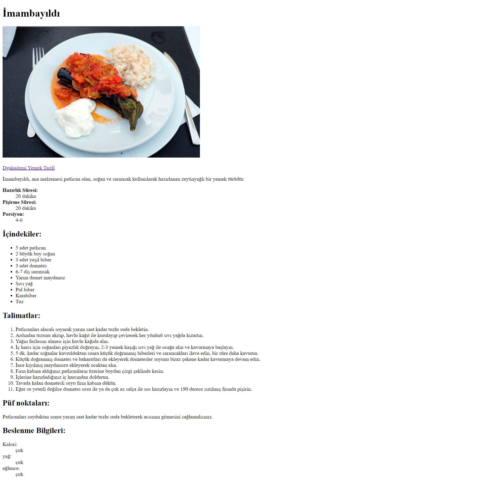

Egzersiz #1 

Bu alıştırmada favori yemek tarifiniz için bir HTML sayfası oluşturacaksınız.

## Egzersiz

1. Tarifimiz için HTML bir tarif sayfası oluşturun
2. Başlık, alt başlık, açıklama, başlıklar (h1/h2 vb.), paragraflar, listeler kullanın
3. Sıralı ve sırasız listeleri uygun şekilde kullanın
4. Yemek resmi ekleyebilirsiniz: https://upload.wikimedia.org/wikipedia/commons/thumb/7/7b/%C4%B0mam_bay%C4%B1ld%C4%B1_AvL.JPG/1920px-%C4%B0mam_bay%C4%B1ld%C4%B1_AvL.JPG
5. 'Dgakademi Yemek Tarifi' yazılı bir bağlantı etiketi ekleyin

> CodePen'in "HTML" ve "Body" etiketleriyle ilgilenmediğini unutmayın, böylece içerikle başlayabilirsiniz
> Sol üstten HTML butonuna basarak HTML kodlarını yazmaya başlayabilirsiniz. Bir yere kaydetmeyi unutmayın kodlar sayfayı yenilediğinizde silinecektir.

## Yemek Tarifi Örneği

Başlık:
İmambayıldı

Tanım:
İmambayıldı, ana malzemesi patlıcan olan, soğan ve sarımsak kullanılarak hazırlanan zeytinyağlı bir yemek türüdür.

Hazırlık Süresi: 20 dakika
Pişirme süresi: 20 dakika
Porsiyon: 4-6

İçindekiler:
5 adet patlıcan
2 büyük boy soğan
3 adet yeşil biber
3 adet domates
6-7 diş sarımsak
Yarım demet maydanoz
Sıvı yağ
Pul biber
Karabiber
Tuz

Talimatlar:
Patlıcanları alacalı soyarak yarım saat kadar tuzlu suda bekletin.
Ardından tuzunu akıtıp, havlu kağıt ile kurulayıp çevirerek her yönünü sıvı yağda kızartın.
Yağın fazlasını alması için havlu kağıda alın.
İç harcı için soğanları piyazlık doğrayın, 2-3 yemek kaşığı sıvı yağ ile ocağa alın ve kavurmaya başlayın.
5 dk. kadar soğanlar kavrulduktan sonra küçük doğranmış biberleri ve sarımsakları ilave edin, bir süre daha kavurun.
Küçük doğranmış domates ve baharatları da ekleyerek domatesler suyunu biraz çekene kadar kavurmaya devam edin.
İnce kıyılmış maydanozu ekleyerek ocaktan alın.
Fırın kabına aldığınız patlıcanların üzerine boydan çizgi şeklinde kesin.
İçlerine hazırladığınız iç harcından doldurun.
Tavada kalan domatesli suyu fırın kabına dökün.
Eğer su yeterli değilse domates sosu ile ya da çok az salça ile sos hazırlayın ve 190 derece ısıtılmış fırında pişirin.

Püf noktaları:
Patlıcanları soyduktan sonra yarım saat kadar tuzlu suda bekleterek acısının gitmesini sağlamalısınız.

Beslenme Bilgileri:
Kalori: çok
yağ: çok
eğlence: çok

## Ödevin Tamamlanmış Hali

      