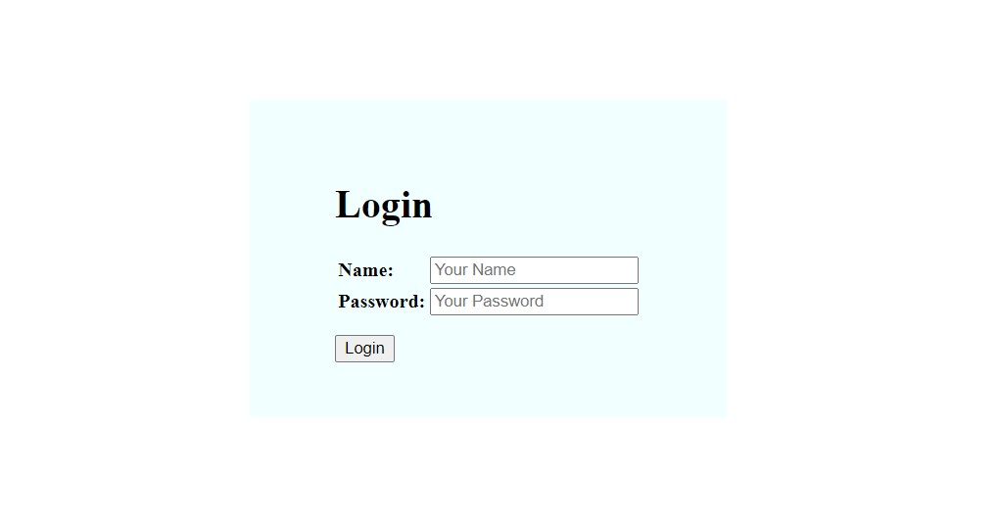
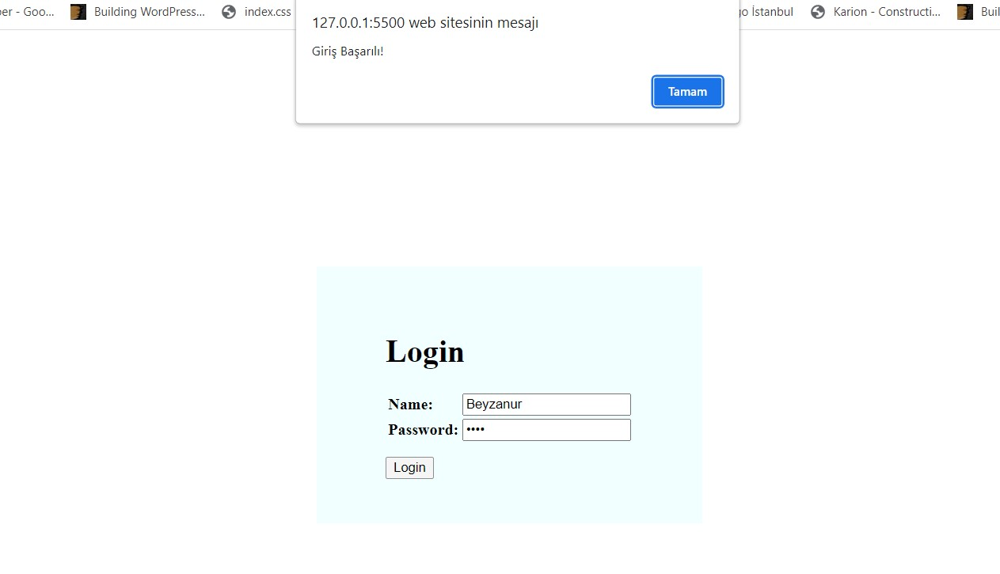
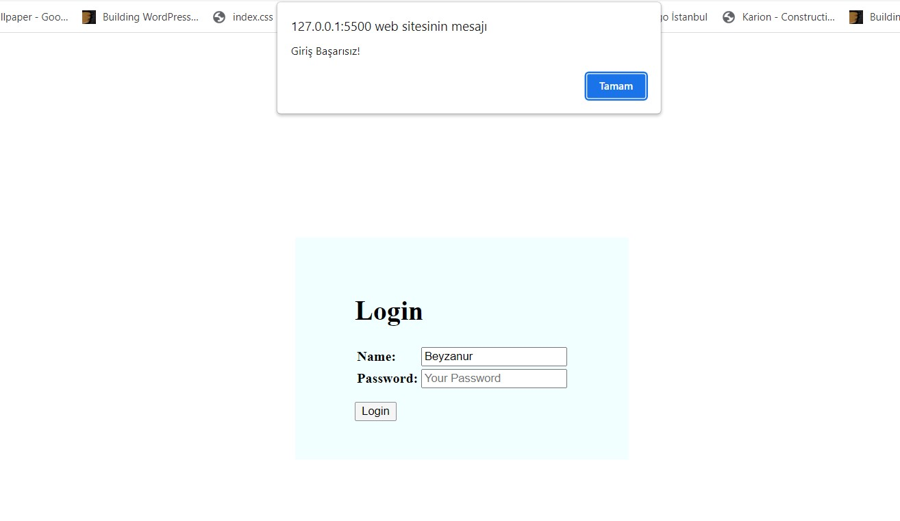

# Ternary Operator Ödevi

Bu ödevde ternary operatorü ile ilgili bir örnek yapmamız istendi. 
Bununla ilgili küçük bir login örneği yaptım.



## Nasıl Çalışıyor?
Login butonuna tıklanıldığında input alanlarına girilen bilgilerin sistemde kayıtlı bilgi ile uyuşup uyuşmadığını kontorol eden bir mekanizma mevcut. 

Sistemde kayıtlı bilgiler şu şekildedir:
```
const user = {
    name:"Beyzanur",
    password:"1234",
};
```

Eğer girilen isim ve şifre bilgisi uyuşuyorsa ekranda "Giriş Başarılı!" şeklinde bir uyarı penceresi görürüz. 




Eğer tam tersi ise "Giriş Başarısız!" şeklinde bir ifade görürüz.



Ternary operator'ünü iki yerde kullandım:

1- Input alanına girilen bilgilerin uyuşup uyuşmadığını kontrol ederken;
    
```
userName.value === user.name && password.value === user.password ? result = true : result = false
```

2- Login butonuna bastığımda ilk kontrolden geriye dönen değeri alıp true ya da false olma durumuna göre;

```
ValidateUserLogin() ? alert("Giriş Başarılı!") : alert("Giriş Başarısız!")
```