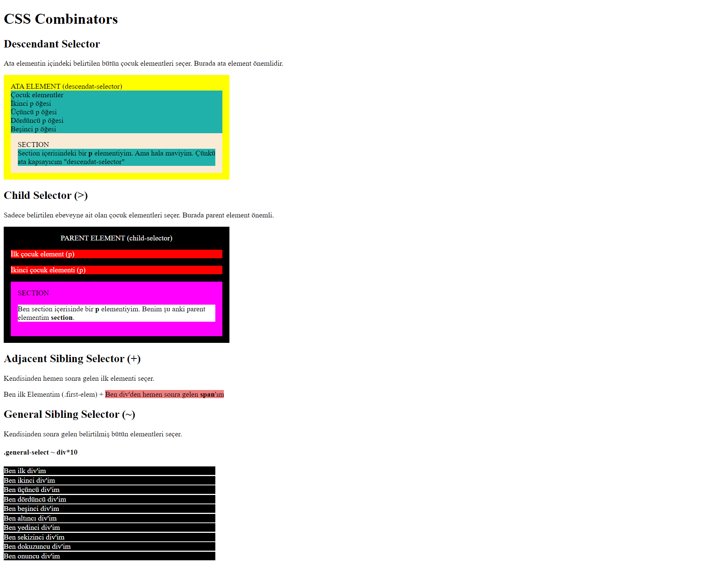

# Araştırma Ödevi - CSS Combinators

Bu ödevde <b>Css Combinators</b> konusunda yer alan alt başlıkların farklarını ele aldım. Ayrıca bu başlıklarla ilgili birer örnek yaptım. Bu şekilde konuyu pekiştirdim.

Ödevi [codesandbox](https://codesandbox.io/s/beautiful-williams-lhyonl?file=/index.html)'tan inceleyebilirsiniz.

## Ele Aldığım Başlıklar:

- Descendamt selector
- Child selector (>)
- Adjacent sibling selector (+)
- General sibling selector (~)

## Ödevin Görünümü

