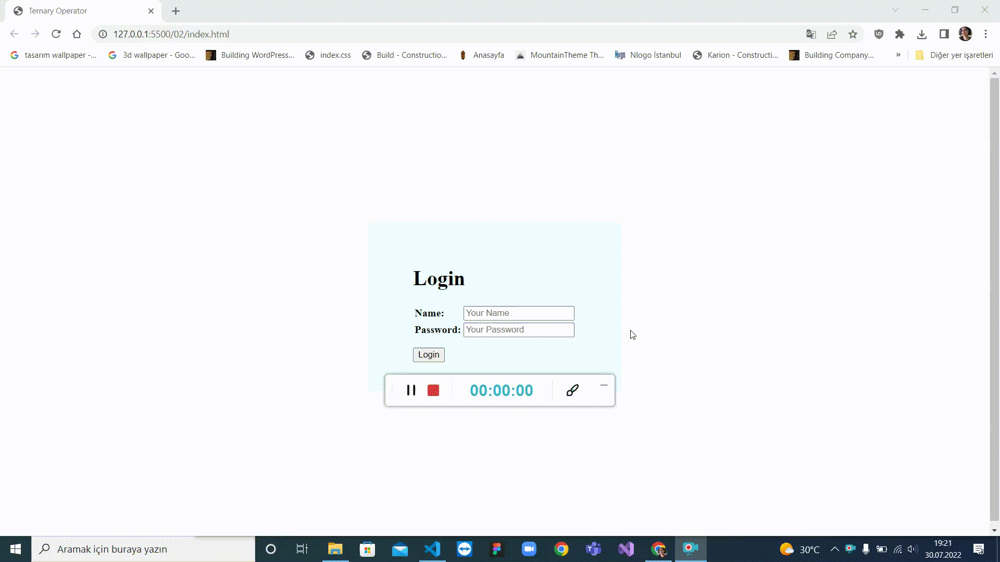

# Ternary Operator Ödevi

Bu ödevde ternary operatorü ile ilgili bir örnek yapmamız istendi. 
Bununla ilgili küçük bir login örneği yaptım.



## Nasıl Çalışıyor?
Login butonuna tıklanıldığında input alanlarına girilen bilgilerin sistemde kayıtlı bilgi ile uyuşup uyuşmadığını kontorol eden bir mekanizma mevcut. 

Sistemde kayıtlı bilgiler şu şekildedir:
```
const user = {
    name:"Beyzanur",
    password:"1234",
};
```

Eğer girilen isim ve şifre bilgisi uyuşuyorsa ekranda "Giriş Başarılı!" şeklinde bir uyarı penceresi görürüz. Eğer tam tersi ise "Giriş Başarısız!" şeklinde bir ifade görürüz.