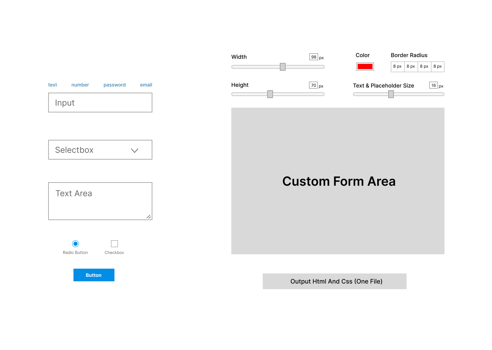

# Form Builder (Proje Fikri)

Bu ödev bir proje fikri içermektedir.

## Temel Problem
Artık günümüzdeki insanlar çağın getirdiği yeniliklerle bir işi hızlı bir şekilde gerçekleştirme eğilimindedirler. Bu işler gündelik hayatın getirdiklerinin yanında iş hayatını da kapsamaktadır. İş hayatında yazılım sektörünü düşünecek olursak; bir yazılım uzmanının bir programı geliştirirken yararlandığı bazı araçlar mevcuttur. Bu araçlar yazılım uzmanının projeyi daha hızlı oluşturmasını sağlar. Bahsettiğim araçlar bunun yanında isteklere göre özelliştirmelere de izin verebilir.

Günümüzde web siteleri, uygulamalar, iletişim formuna ihtiyaç duyan bütün platformlar form öğelerini barındırırlar. Çoğu zaman bu form öğelerinin hem sunucu tarafında hem de görünür tarafta başarılı olması istenir. Görünür tarafın hem estetik, hem de göze hitap etmesi istenebilir.

Araştırmalarıma göre bir yazılım uzmanının front-end alanında projesi için yararlanabileceği hayata geçirilmiş bir çok araç mevcut. Form öğesi için yararlanabilecek hazır bileşenleri barındıran çözümler var ancak yapılmak istenen projenin özel bir tasarım olduğunu düşünürsek hazır bileşenleri kullanmak doğru olmayacaktır. Özel tasarımlar için hayata geçirilmiş bir çözüm bulunmamakta.

## Hedef Kitle
Front-end geliştiriciler

## Çözüm
İşte bu noktada özel bir form oluşturucu projesi yapmak bu soruna güzel bir çözüm olacaktır.

## Form Builder Ne Sağlar?
Front-end geliştiricileri özel tasarımların form öğelerini daha hızlı oluşturur.

## Form Builder Neden Tercih Edilmeli?
- Pratik
- Basit arayüze sahip
- Aracı tanıyıp kullanması kolay
- Özel tasarım olan projelerde hıza hız katar.

<a href="https://www.figma.com/file/adPFcqmd1HHg2MNvS99aAS/Form-Builder?node-id=0%3A1">
<h2>Detayı Görüntüle</h2>
</a>

## Prototip

