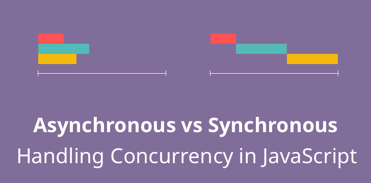
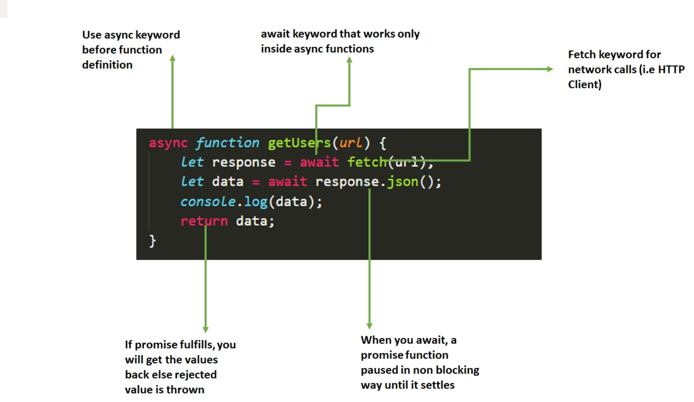
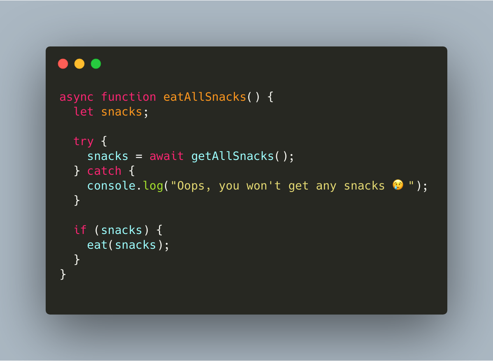
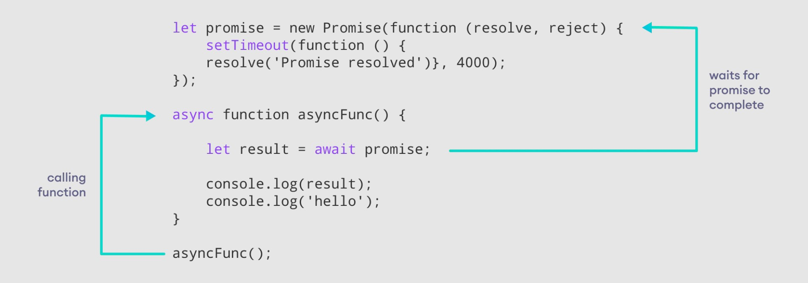
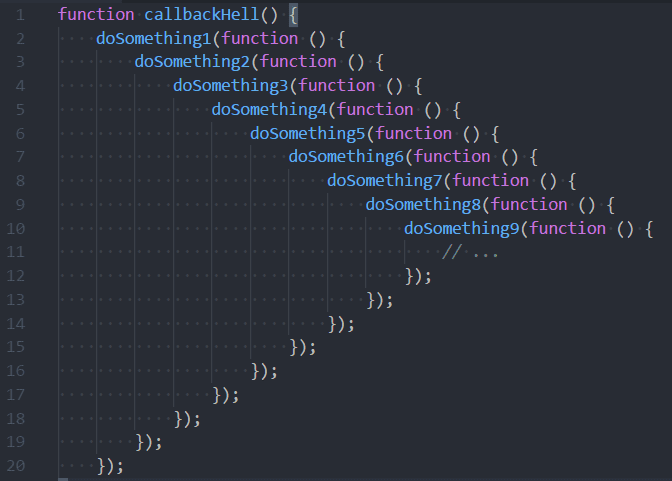
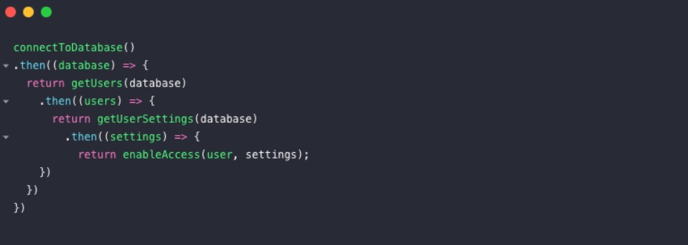

# ASYNC-AWAIT

## Asenkron ve Senkron Programlama

### Asenkron Programlama

Kod akışının sırayla işlemediği, işlemlerin birbirini beklemediği, kod akışının işlem süresine göre devam ettiği programlamaya asenkron programlama denir. Asenkron programlamanın çalışma şekli sıradaki işlemin ne kadar sürdüğüyle ilgilidir. Kod akışında en kısa sürede biten işlemi ilk sıraya, en geç biten işlemi ise en sona alarak sürecini tamamlar.
  

### Senkron Programlama

Kod akışı belirlediğimiz sıraya göre işler. Senkron programlama, işlemlerin ne kadar sürdüğüyle ilgilenmez.

<table>
<tbody>
<tr>
<th>Asenkron Pogram</th>
<th>Senkron Program</th>
</tr>
<tr>
<td>1 saniye</td>
<td>5 saniye</td>
</tr>
<tr>
<td>3 saniye</td>
<td>1 saniye</td>
</tr>
<tr>
<td>6 saniye</td>
<td>2 saniye</td>
</tr>
</tbody>
</table>

<pre>
function PrintToConsoleLogOne(){
    console.log("İlk Komut");
}
</pre>

<pre>

function PrintToConsoleLogTwo(){
    console.log("İkinci Komut");
}

</pre>

<pre>
PrintToConsoleLogOne();
PrintToConsoleLogTwo();
</pre>

Javascript hem asenkron hem de senkron programlama dilidir. Bazı durumlarda kodlar sırasıyla çalışırken bazı durumlarda istenilen sırada çalışmaz.

İşte bazı durumlar gelir ki, bizim senkron bir şekilde çalışan kod yazmamız gerekir.

## Async-Await 

Async ve await ES7 ile birlikte gelmiştir.

Await, hakkında temel olarak bahsedecek olursak sözdizimsel (syntatic) rahatlatıcıdır. Asenkron kodunuzun, anlaşılması daha kolay olan senkron kod gibi görünmesini sağlar.
Rahat okunabilir hale gelecek.
Asenkron işlemlerin gerçekleşme sırasını daha rahat bir şekilde takip edebileceğiz.

async anahtar kelimesi sadece fonksiyonlarda kullanırız. Async'nin kullanıldığı fonksiyonun bir promise fonksiyonu olduğunu, await ise fonksiyonun içerisindeki komutların birbirini beklemesi gerektiğini belirtir.

Not: Await kullanmak istiyorsak mutlaka async ile birlikte kullanmalıyız! Async-await söz dizimi gerekliliğidir.

<pre>
async function AsnkronPgram(){
    const MyFirstAwaitFnc = await PrintToConsoleLogTwo();
    const MySecondAwaitFnc = await PrintToConsoleLogTwo();
}

AsnkronPgram();
</pre>

  
### Nerelerde Kullanılır?

  

### Neden Async Await Var? Callback? Promise?  

#### Callback Hell

  

#### Fetch Api - Then Chain (Promise Hell)

<pre>
function GetMyApi(){
    fetch("url").
    then().
    then().
    then().
    then().
    then().
    .
    .
    .
    .
    .
    .
    .
}
</pre>

  
<b>Beni dinlediğiniz için teşekkür ederim.</b>

<em>Kaynaklar:</em>
 
https://www.linkedin.com/pulse/async-await-nedir-ard%C4%B1l-ozan-tekin/?originalSubdomain=tr
 
https://www.gencayyildiz.com/blog/ecmascript-6-async-await-keywordleri/
 
https://tr.javascript.info/async-await
 
https://www.youtube.com/watch?v=4lyv0ssRnAc
 
https://www.youtube.com/watch?v=d6rOJz5D2rc
