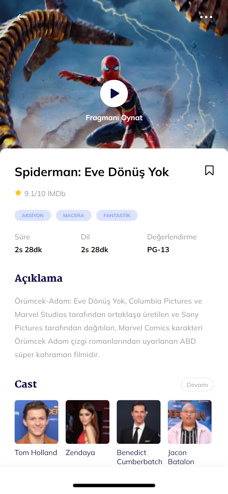
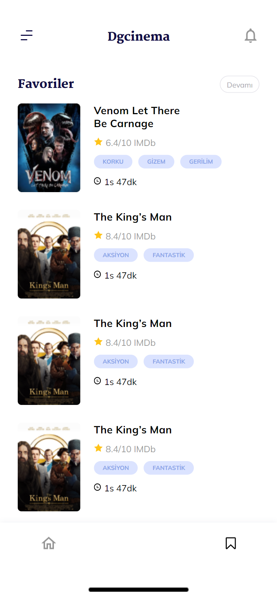

# DgAkademi Movie App 🎞

- Bu proje bir film uygulamasıdır ve önceden tasarlanmış figma tasarımının kodlanmış halidir.
- Mobil öncelikli olarak kodlanmıştır. Sadece mobil görünüm mevcuttur.
- Uygulama üç sayfadan oluşmaktadır: Anasayfa, favoriler ve detay sayfası.

## Kullanılan Diller veya Teknolojiler

- HTML (html structure)
- SCSS (flex layout)

<b>İnceledeğiniz için teşekkür ederim.</b>