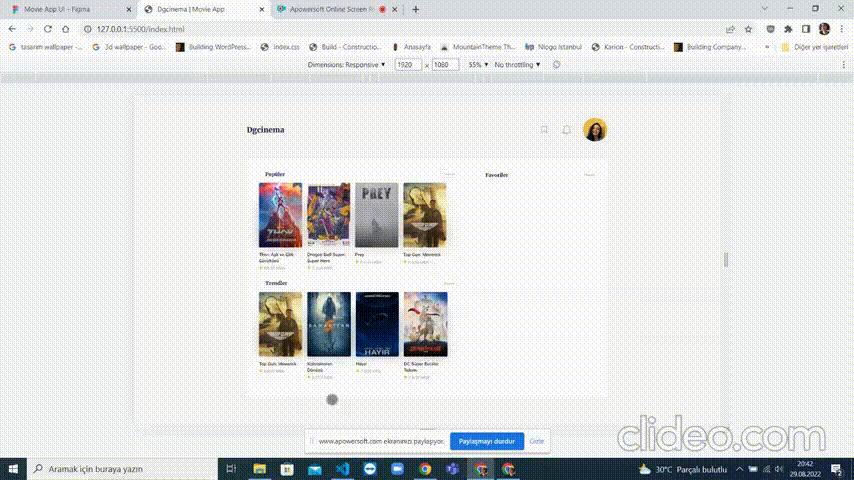
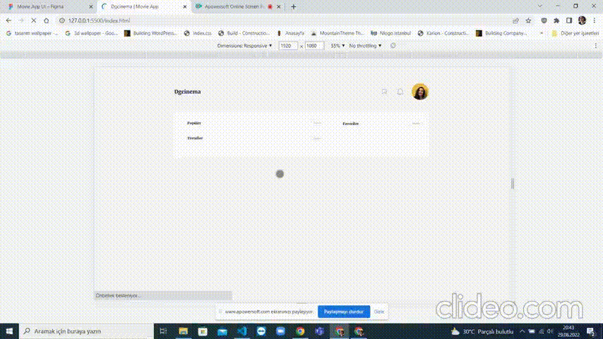
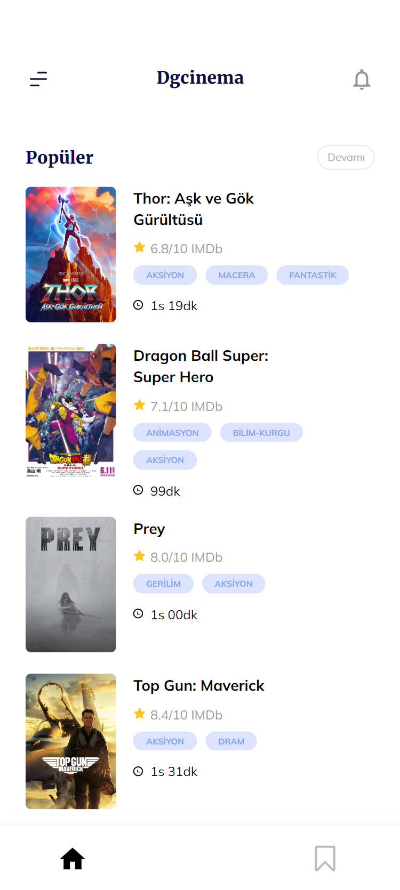
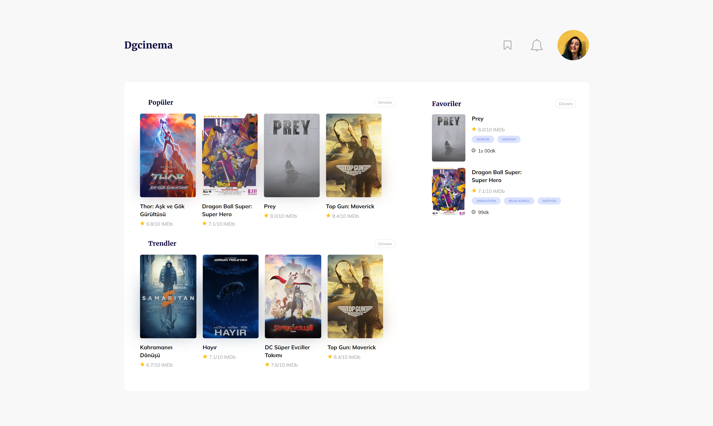

# DgAkademi Movie App 🎞

- Bu proje bir film uygulamasıdır ve önceden tasarlanmış [figma tasarımı](https://www.figma.com/file/Bq3LDs3EdvTQ2qGANrlSuf/Dgakademi-Movie-Mobile-App-UI-Design-(Community)?node-id=3%3A2)nın html, scss ve javasvript ile kodlanmış halidir.
- Mobil öncelikli olarak kodlanmıştır. Mobil ve daha geniş ekranlar için çözünürlükler ayarlanmıştır.
- Tasarıma uyularak pixel perfect tasarım yapılmaya çalışılmıştır.
- Bu uygulama verileri [the-movie-db](https://www.themoviedb.org/documentation/api) adresinden almaktadır.
- Uygulamada popüler filmler, trend filmler ve favoriler bölümleri yer almaktadır.
- Filmler favorilere çerezler kullanılarak eklenebilmektedir. Listeden çıkarılabilmektedir.

## Kullanılan Diller veya Teknolojiler

- HTML (semantic kodlama standardı)
- SCSS (flex ve grid yapısı)
- Javascript (fetch api, localstorage)

<table>
<tbody>
<tr>
<th>Mobil Görünüm</th>
<th>Laptop Görünümü</th>
</tr>
<tr>
<td></td>
<td></td>
</tr>
</tbody>
</table>

<b>İnceledeğiniz için teşekkür ederim.</b>
